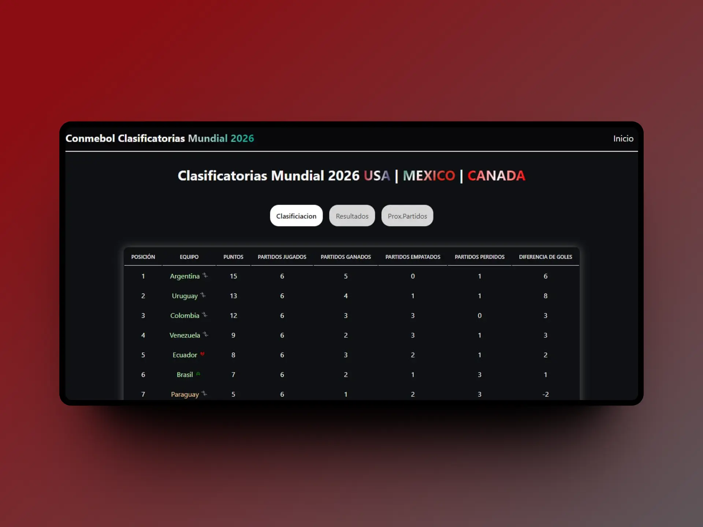

# Conmebol-Eliminatorias
Proyecto de Seguimiento de las Eliminatorias Sudamericanas al Mundial de Fútbol

Este proyecto está diseñado para seguir las eliminatorias sudamericanas para el próximo Mundial de Fútbol. Proporciona una interfaz intuitiva y actualizaciones en tiempo real sobre los resultados de los partidos, las clasificaciones de los equipos y otra información relevante para los aficionados al fútbol.

Créditos
Este proyecto utiliza la API proporcionada por fcoagz para obtener los datos de las eliminatorias sudamericanas. Agradecemos a fcoagz por su contribución a la comunidad de desarrollo.

Características
Visualización de resultados de partidos en tiempo real.
Clasificaciones actualizadas de los equipos participantes.
Detalles de los próximos partidos y horarios.
Interfaz de usuario intuitiva y fácil de usar.

## TODO

 [x] Conseguir una api para las banderas de los paises

 [] Conseguir que guarde el estado de donde se queda el usuario en la jornada
